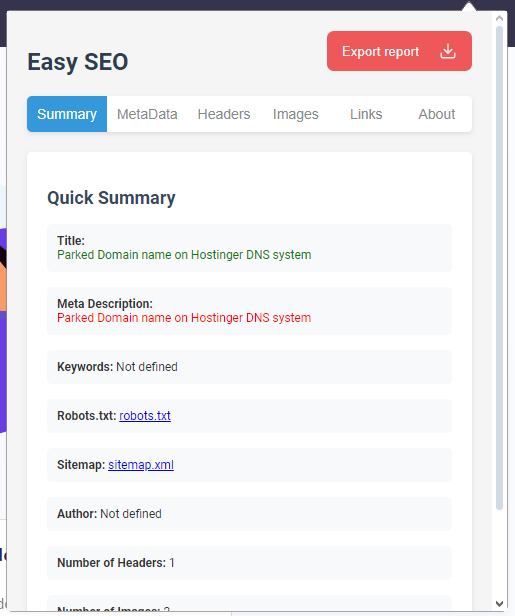
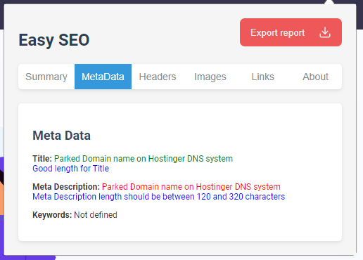
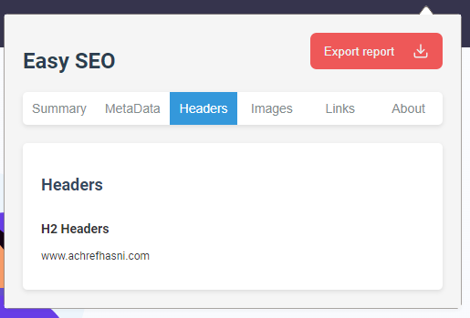
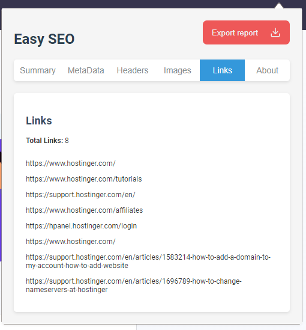

# Easy SEO Level up
Easy SEO Level up is a browser extension designed to streamline SEO analysis and optimization for websites. With this tool, you can quickly assess and improve key SEO elements directly in your browser, making it perfect for SEO professionals, content creators, and web developers aiming to enhance their search engine rankings with minimal effort.

## Features
* Headers Structure: See the hierarchical structure of headers (H1, H2, etc.) on your page.
* Metadata Analysis: Review essential SEO metadata, including title, description, and keywords.
* Image Audit: Check all images on the page, identify missing alt attributes, and analyze image file sizes.
* Link Analysis: Analyze internal and external links to ensure a robust linking strategy.
* Sitemap and Robots.txt Checker: Review your sitemap and robots.txt files for optimal search engine indexing.
* Export SEO Reports: Export comprehensive SEO reports for further analysis or sharing.

## Installation
1- Download the `.zip` file of this extension or clone the repository to your local machine.

2- Open your browser’s Extensions settings.

3- Enable Developer mode (usually found in the top-right corner).

4- Select Load unpacked and choose the folder where this extension is stored.

5- The extension should now be available in your browser toolbar.

## Usage

1- Click on the Easy SEO Level up icon in your browser’s toolbar to open the extension.

2- Navigate through the tabs:

* Summary: View a quick overview of your website's essential SEO elements.
* MetaData: Examine metadata details for title, description, and keywords.
* Headers: View a structured layout of the page headers (H1, H2, etc.).
* Images: Check images for alt attributes and sizes.
* Links: Analyze internal and external links.
3- Click on the Export Report button to download a detailed report for offline analysis.

## Screenshots
### Overview

### Metadata Analysis
)

### Header Structure
)

### Image Audit
)

### Link Analysis
)